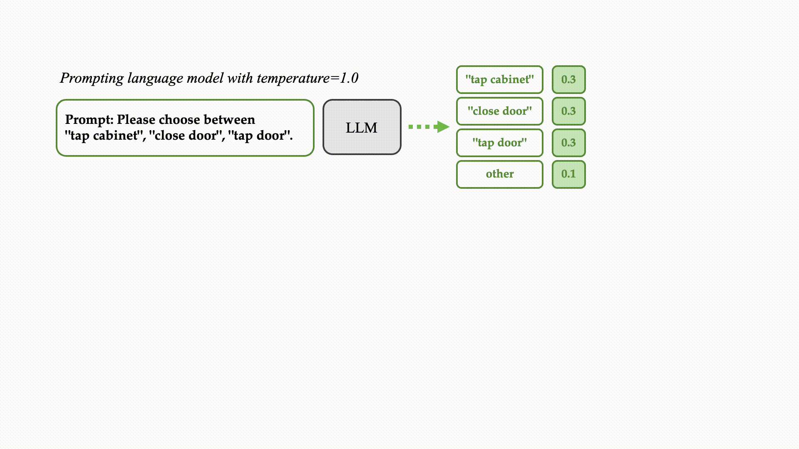

# Long Horizon Temperature Scaling

This repository contains code for the paper:

[Long Horizon Temperature Scaling](https://arxiv.org/abs/2302.03686) \
by Andy Shih, Dorsa Sadigh, Stefano Ermon

<br>



## Installation
```
pip install -r requirements.txt
```


## Commands
Check out more detailed configs in this [config file](conf/config_gpt2.yaml).
```
WANDB_MODE=disabled torchrun --master_port=29601 --nproc_per_node=1 main_gpt2.py gpt_name=gpt2 horizon_loss.T=0.9

WANDB_MODE=disabled torchrun --master_port=29602 --nproc_per_node=1 main_gpt2.py gpt_name=gpt2-medium horizon_loss.T=0.9

WANDB_MODE=disabled torchrun --master_port=29603 --nproc_per_node=1 main_gpt2.py gpt_name=gpt2-large horizon_loss.T=0.9
```


## Citation
If you find our work useful, consider citing:
```
"Long Horizon Temperature Scaling"
Andy Shih, Dorsa Sadigh, Stefano Ermon
In Proceedings of the 40th International Conference on Machine Learning (ICML), 2023

@inproceedings{shih2023longhorizon,
  author    = {Andy Shih and Dorsa Sadigh and Stefano Ermon},
  title     = {Long Horizon Temperature Scaling},
  booktitle = {Proceedings of the 40th International Conference on Machine Learning (ICML)},
  month     = {july},
  year      = {2023},
}
```
